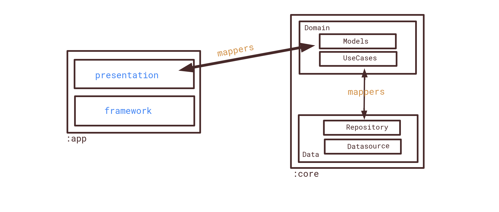

 

# Ping myBills

An android app to help you track your bills. It is built with clean architecture principles and the MVVM repository pattern using the power of Architecture Components.

## Table of Contents
- [Architecture](#architecture)
- [Libraries](#librariries)
- [Testing](#testing)
- [Related Posts](#posts)
- [Demo](#demo)

## Architecture
For better abstration, we split the application into three layers spread across two distinct modules. This ensures robustness and makes our app extensible. The two modules are:

- :core
- :app

The :app modules contains the UI layer while the :core module contains the domain and the data layer. This three layered architecture is inspired by the [Clean Architecture design pattern](https://blog.cleancoder.com/uncle-bob/2012/08/13/the-clean-architecture.html)

### :app module
The app module holds the `framework` and the `presentation` packages. The `framework` package holds non-core-ui implementations while the `presentation` layer is dedicated to core UI implementations.
#### presentation
The presentation layer use `ViewModel` to manage application state and `data-binding` to hook ViewModels to reactive views.

### :core module
The core module holds the domain and data layers.
#### Domain Layer
The `domain layer` defines data classes that are used to bridge the data needs of the data and presentation layer. It also defines the `UseCases` that the presentation layer reuses for various accessibility and manipulation of the data.
#### Data Layer
<<<<<<< Updated upstream
The `data layer` holds the the data entity that implements our core business needs. It uses distinct `datasources` abstracted away by a repository to ensures a single channel for accessing and manipulation of the data. 
=======
The `data layer` holds the the data entity that implements our core business needs. It uses distinct `datasources` abstracted away by a repository to ensures a single channel for accessing and manipulation of the data.
